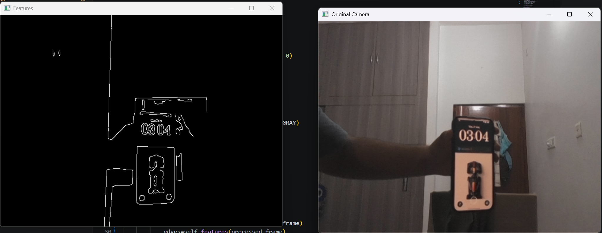
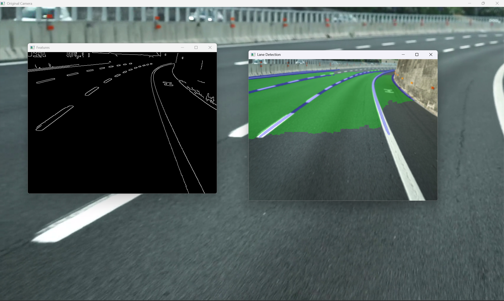

# Elecruisers Vision

Computer vision pipeline for autonomous navigation and lane detection developed as part of the Elecruisers project.

## Overview

This project processes live camera input and performs lane detection using a deep learning-based approach. Traditional computer vision methods such as Hough Transform and Sliding Window techniques were evaluated but showed limitations when handling curved roads and complex lane geometries. To improve robustness and real-world performance, the project utilizes the YOLOPv2 model for lane detection.

---

## Pipeline

```text
Camera Input
    ↓
Frame Capture
    ↓
Resize & Preprocessing
    ↓
Feature Extraction
    ↓
Lane Detection
    ↓
Visualization & Output
```

### Processing Steps

1. Capture frames from the primary camera (webcam).
2. Resize frames to 640 × 480 resolution.
3. Apply Gaussian Blur to reduce image noise.
4. Normalize image data (optional preprocessing step).
5. Extract image features.
6. Perform lane detection using YOLOPv2.
7. Display processed output in real time.

---

## Technologies Used

* Python
* OpenCV (cv2)
* NumPy
* PyTorch
* YOLOPv2

---

## Why Deep Learning?

Initially, traditional lane detection techniques were explored:

### Hough Transform

* Effective for straight lanes.
* Performance degrades on curved roads.
* Sensitive to lighting conditions and road markings.

### Sliding Window Method

* Better than Hough Transform for some curved lanes.
* Requires careful parameter tuning.
* Can become unstable in complex road environments.

While a combination of both approaches can improve results, they are often insufficient for dynamic real-world autonomous systems.

Therefore, a deep learning-based solution was adopted. YOLOPv2 provides significantly better performance on:

* Curved lanes
* Partial lane markings
* Shadows and varying illumination
* Complex road structures
* Real-time inference requirements

---

## Model Weights

Due to GitHub's file size restrictions, the model weights are not included in this repository.

Download the pretrained YOLOPv2 weights here:

**Model Download:**
[https://github.com/CAIC-AD/YOLOPv2]

Place the downloaded file in the project root directory

## Sample Output




